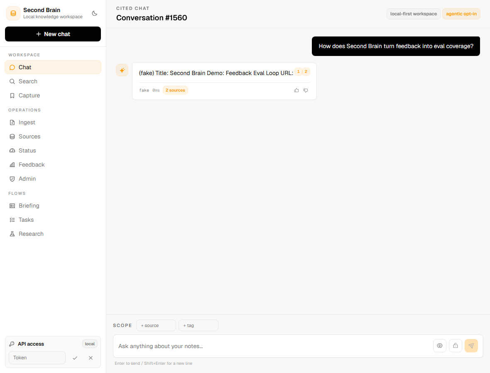

<div align="center">

# 🧠 Second Brain

**A personal, always-on AI assistant — RAG + Agent + MCP — that runs on one small VPS.**

Ingest your notes, PDFs, and bookmarks; chat over them with **cited** answers; run **hybrid
semantic + full-text search**; get an automated **morning briefing**; take actions through an
**MCP server**; and let it do its own **self-research** — all on the Gemini API free tier for
~$4–6/month.

[](docs/USAGE.md)
[](docs/PROGRESS.md)
[](#-tech-stack)
[](deploy/caddy/Caddyfile)
[](.github/workflows)
[](#-cost-model)

</div>

---

<div align="center">
  
  <br>
  <sub>Chat over your own notes — every answer is grounded with inline source citations.</sub>
</div>

> **🟢 Live in production** behind real, auto-renewing **Let's Encrypt HTTPS** on a single **2 GB**
> droplet. How to use & operate it → **[`docs/USAGE.md`](docs/USAGE.md)**.

---

## 📖 Overview

Second Brain is a daily-usable RAG application engineered to demonstrate the full AI-applications
stack end to end: LLM integration, embeddings, vector + full-text retrieval, evaluation/MLOps,
agentic tool-use over MCP, and production data operations on PostgreSQL.

It is deliberately **cost-minimal** — generation runs off-box on **`gemini-2.5-flash`** (free tier),
embeddings can run locally on ingest **or** be offloaded to the hosted Gemini embeddings API so the
whole stack fits a 2 GB VPS, and everything else is self-hosted in Docker Compose on a single
~$4–6/mo box. A local Ollama "private mode" sits behind the same `LLMClient` interface.

> **New here?** Read [`AGENTS.md`](AGENTS.md) (source of truth) → [`docs/PROGRESS.md`](docs/PROGRESS.md)
> (current state) → [`docs/project-plan.md`](docs/project-plan.md) (full detail).

## 🆕 What's New

Most recent first. Full dated log in [`docs/PROGRESS.md`](docs/PROGRESS.md).

| Change | Summary | PR |
|---|---|:---:|
| **🚀 Live production deployment** | **Caddy** reverse proxy with auto-renewing **Let's Encrypt HTTPS** via `*.sslip.io` — real TLS with **no domain required** (`http → https` redirect). The 9-service stack runs end-to-end on a 2 GB DigitalOcean droplet; full ops guide added in [`docs/USAGE.md`](docs/USAGE.md). | [#14](https://github.com/tomnguyen103/second-brain/pull/14) |
| **🔁 Hosted Gemini embeddings** | Optional `gemini-embedding-001` provider, requested at **384 dimensions** to stay drop-in compatible with the existing `vector(384)` column — lets the app fit a 2 GB box with **no schema change** or local torch model. | [#13](https://github.com/tomnguyen103/second-brain/pull/13) |
| **🤖 Model refresh** | Default LLM pinned to **`gemini-2.5-flash`** (the retired `gemini-1.5-flash` was removed); swappable via `SECOND_BRAIN_GEMINI_MODEL`. | [#12](https://github.com/tomnguyen103/second-brain/pull/12) |
| **🧹 Repo hygiene** | Local agent-tooling dirs (`.agents/`, `.codex/`, `.claude/`) are gitignored — they stay on-box but out of version control. | [#16](https://github.com/tomnguyen103/second-brain/pull/16) |

## ✨ Features

| | Feature | What it proves |
|---|---|---|
| 💬 | **Chat over your docs** — RAG with inline source citations | LLM integration · retrieval · summarization |
| 🔎 | **Hybrid search** — pgvector semantic + Postgres full-text, rank-fused (RRF) | embeddings · vector DB · ranking |
| 📰 | **Morning briefing** — scheduled summary of new inputs | data pipelines · scheduled ops |
| 🛠️ | **Agentic actions via MCP** — search, create/list task, send digest, research | tool-use / agentic patterns |
| 🧪 | **Self-research** — "research X" → summarize → store → auto-ingest | agentic pipelines · integration |
| 🔒 | **Governed data-ops** — RLS, audit, retention TTL, GDPR export/erasure | production data operations |

## 🧱 Tech Stack

| Layer | Choice |
|---|---|
| **LLM generation** | **`gemini-2.5-flash`** API (default) · local Ollama (private mode) — one `LLMClient` interface; model swappable via `SECOND_BRAIN_GEMINI_MODEL` |
| **Embeddings** | Pluggable provider (`SECOND_BRAIN_EMBEDDING_PROVIDER`): local `sentence-transformers` MiniLM (384-dim, default) **or** hosted `gemini-embedding-001` (pinned to 384-dim) — both write the same `vector(384)` column |
| **Datastore** | self-hosted **PostgreSQL** — relational + **pgvector** + full-text (tsvector) + JSONB + analytics + RLS/audit |
| **Cache / Pooling** | Redis (embedding/query cache, rate limiting) · PgBouncer (connection pooling) |
| **Backend / Frontend** | Python + **FastAPI** · **Next.js + TypeScript** |
| **Agent tooling** | **MCP** server (stdio) — 5 tools |
| **Edge / TLS** | **Caddy** reverse proxy — automatic Let's Encrypt HTTPS via `sslip.io` (no domain) |
| **MLOps / CI-CD** | MLflow (eval + prompt/model versioning) · GitHub Actions (**eval-gated**) |
| **Observability** | Prometheus + Grafana |
| **Runtime** | Docker Compose on one VPS · Kubernetes as a Phase 7 learning track (local k3s/kind) |

## 🗺️ Roadmap

| Phase | Description | Status |
|:---:|---|:---:|
| **0** | Data model · ER diagram · Alembic migrations · pgvector/full-text indexes | ✅ Complete |
| **1** | RAG MVP — FastAPI `/ingest` + `/chat`, hybrid retrieval, `LLMClient` | ✅ Complete |
| **2** | Next.js chat UI — citations, semantic search, feedback | ✅ Complete |
| **3** | Evaluation + MLOps — eval set, MLflow, A/B, prompt versioning + rollback | ✅ Complete |
| **4** | MCP server + agentic actions (incl. self-research) | ✅ Complete |
| **5** | Daily briefing + scheduled pipelines | ✅ Complete |
| **6** | Productionize on VPS + data-ops hardening (RLS, retention, pooling, tuning) | ✅ Complete |
| **7** | Kubernetes learning track on local k3s/kind | ✅ Complete |
| **★** | **Live deployment** — Caddy HTTPS on a 2 GB droplet, end-to-end verified | ✅ **Live** |

Live status & dated log: [`docs/PROGRESS.md`](docs/PROGRESS.md).

## 🏗️ Production Architecture

One Docker Compose project (`second-brain`) on one droplet — **9 services**:

```
                          Internet (HTTPS)
                                │
                       ┌────────▼────────┐
                       │      caddy      │  TLS · Let's Encrypt · sslip.io
                       │ reverse proxy   │  /api/* → api   ·   /* → frontend
                       └───┬─────────┬───┘
                  ┌────────▼──┐   ┌──▼─────────────┐
                  │ frontend  │   │      api       │  FastAPI
                  │ (Next.js) │   │ /ingest /chat  │
                  └───────────┘   │ /search …      │
                                  └──┬───────────┬─┘
                       ┌─────────────▼──┐    ┌───▼────┐
                       │    pgbouncer   │    │ redis  │  cache · rate-limit
                       └───────┬────────┘    └────────┘
                       ┌───────▼────────┐    ┌──────────────────┐
                       │  db (pgvector) │    │ worker           │  daily briefing
                       └────────────────┘    │ + async research │  (job queue)
                                              └──────────────────┘
            observability:  prometheus  ·  grafana   (private, SSH-tunnel only)
```

## 📂 Repository Layout

```
second-brain/
├── README.md                       # you are here
├── AGENTS.md                       # source of truth for all coding agents
├── docker-compose.yml              # local dev: Postgres + pgvector (host :5433)
├── backend/                        # FastAPI app + data layer
│   ├── app/                        # api · rag · llm · embeddings · mcp_server · jobs · eval
│   ├── migrations/                 # Alembic versioned migrations
│   └── tests/                      # pytest suite (unit + integration)
├── frontend/                       # Next.js + TypeScript chat / search UI
├── deploy/                         # production + Kubernetes
│   ├── docker-compose.prod.yml     # 8-service production stack
│   ├── docker-compose.vps.yml      # VPS override: Caddy + localhost binds (real file gitignored)
│   ├── docker-compose.vps.yml.example
│   ├── caddy/Caddyfile             # HTTPS reverse proxy
│   ├── pgbouncer/ · prometheus/    # pooling + monitoring config
│   └── k8s/                        # kind learning-track manifests + README
└── docs/
    ├── USAGE.md                    # ← how to use & operate the live deployment
    ├── PROGRESS.md                 # running status log
    ├── project-plan.md             # full plan + JD-coverage matrix
    ├── implementation-notes.md     # off-spec decisions log
    ├── adr/                        # 14 architecture decision records
    ├── runbooks/                   # deploy checklist · backup/restore · incident response
    ├── data-model/er-diagram.md    # Phase 0 ER diagram
    └── screenshots/                # UI captures
```

## 🚀 Quickstart — run locally

Requires Docker and Python 3.11+ (and Node 18+ for the UI).

```bash
# 1. Postgres + pgvector (dev compose is db-only, host port 5433)
docker compose up -d db

# 2. Backend API → http://localhost:8000
cd backend
python -m venv .venv && . .venv/Scripts/activate     # Windows; use bin/activate on macOS/Linux
pip install -r requirements.txt
alembic upgrade head
#   Set SECOND_BRAIN_GEMINI_API_KEY, or SECOND_BRAIN_LLM_PROVIDER=fake to run without a key.
uvicorn app.main:app --reload

# 3. Frontend → http://localhost:3000
cd ../frontend && npm install && npm run dev
```

Verify the API: `curl -s localhost:8000/health` → `{"status":"ok","db":"ok",...}`.
Backend-only run & verify details are in [`backend/README.md`](backend/README.md).

## ☁️ Deploy to a VPS

The production stack is one Compose project composed from **two** files, fronted by Caddy for
HTTPS. The complete, verified procedure — env files, `sslip.io` TLS, the `-p second-brain`
gotcha, updates, backups, and monitoring tunnels — lives in **[`docs/USAGE.md`](docs/USAGE.md)**.

```bash
# On the box (abridged — see docs/USAGE.md for the full guide):
DC="docker compose -p second-brain -f deploy/docker-compose.prod.yml -f deploy/docker-compose.vps.yml --env-file deploy/.env.prod"
$DC up -d --build      # build images, run migrations, start all 9 services
$DC ps                 # all services healthy
```

> TLS with no domain: `<ip>.sslip.io` resolves to your droplet's IP, so Caddy obtains a real
> Let's Encrypt certificate automatically. Swap in a real domain later via `CADDY_SITE_ADDRESS`.

## ☸️ Kubernetes learning track (run & verify)

Kubernetes here is a **learning track, not the production runtime** (prod stays the single-VPS
Docker Compose stack). The manifests in [`deploy/k8s/`](deploy/k8s/) prove the whole stack runs on
real K8s — Postgres StatefulSet+PVC, a migrate Job, api/worker/frontend Deployments, ingress-nginx,
an HPA that scales `api` under load, and Prometheus+Grafana — then the cluster is **torn down** so
nothing keeps running ($0). Decisions in [ADR-0014](docs/adr/0014-kubernetes-learning-track.md);
evidence in [`docs/k8s-evidence/`](docs/k8s-evidence/); CI in
[`.github/workflows/k8s.yml`](.github/workflows/k8s.yml).

```bash
# Requires Docker Desktop + kind + kubectl. Full guide: deploy/k8s/README.md
kind create cluster --name second-brain --config deploy/k8s/kind-cluster.yaml
kubectl apply -k deploy/k8s
curl -H 'Host: api.second-brain.local' http://localhost/health    # {"status":"ok","db":"ok",...}
kind delete cluster --name second-brain                           # teardown — leave nothing running
```

## 📐 Architecture & Decisions

- **System design & cost model** → [`docs/project-plan.md`](docs/project-plan.md)
- **Data model (ER diagram)** → [`docs/data-model/er-diagram.md`](docs/data-model/er-diagram.md)
- **Operations & runbooks** → [`docs/USAGE.md`](docs/USAGE.md) · [`docs/runbooks/`](docs/runbooks/)
- **Architecture Decision Records** → [`docs/adr/`](docs/adr/) (14 total)
  - [ADR-0001](docs/adr/0001-llm-driver-local-vs-hosted.md) — hosted Gemini default, local Ollama behind one interface
  - [ADR-0002](docs/adr/0002-embeddings-storage-and-model.md) — embeddings: separate table, `vector(384)`, HNSW
  - [ADR-0005](docs/adr/0005-hybrid-retrieval-rrf.md) — hybrid retrieval via reciprocal rank fusion
  - [ADR-0010](docs/adr/0010-mcp-server-and-agentic-actions.md) — MCP server + agentic actions
  - [ADR-0011](docs/adr/0011-vps-provider.md) — VPS provider choice
  - [ADR-0012](docs/adr/0012-productionization-and-data-governance.md) — productionization + data governance
  - [ADR-0014](docs/adr/0014-kubernetes-learning-track.md) — Kubernetes learning track

## 💰 Cost Model

Generation runs on `gemini-2.5-flash`'s free tier (~1,500 req/day — ample for one user),
embeddings run locally on ingest **or** on the hosted Gemini embeddings free tier, and
Postgres/Redis/PgBouncer/MLflow/Prometheus/Grafana/Caddy are all self-hosted containers on the
same box. HTTPS is free (Let's Encrypt via `sslip.io`, no domain to buy). The **only recurring
cost is the VPS: ~$4–6/month** (e.g. a 2 GB DigitalOcean/Hetzner/Vultr/Linode droplet). No GPU,
no per-token bill.

---

<div align="center">
<sub>A personal project, used daily — built in public, one phase at a time.</sub>
</div>
