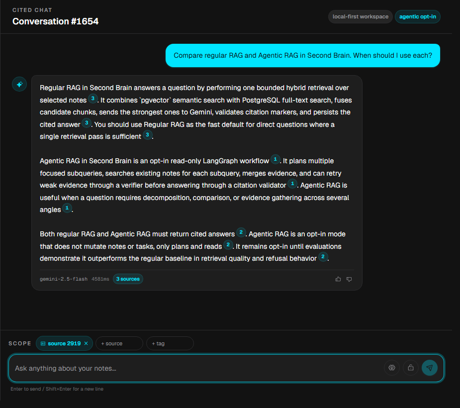
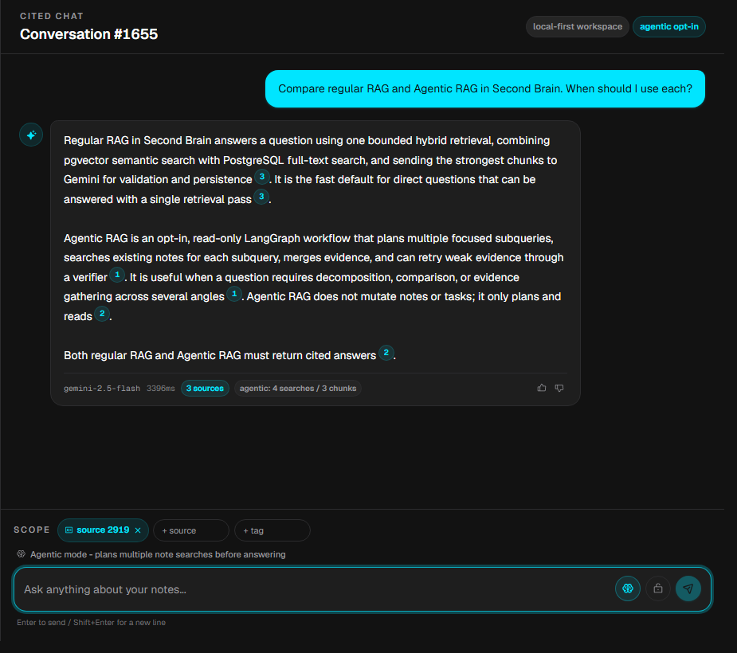

<div align="center">

# Second Brain

**A local-first personal AI workspace for streaming cited RAG, hybrid search, source management, briefings, and MCP-powered actions.**

Second Brain captures web passages and personal knowledge, stores them in PostgreSQL with pgvector
and full-text indexes, serves citation-validated answers over SSE, produces briefings, and exposes
agentic tools over MCP. The web app now uses the repo-local WattVision DesignMD system: a dark,
monitoring-dashboard workspace with a warm inspection-mode light toggle, a Sources management home,
a guarded Admin console, and a live Status surface. The default runtime is local-first Docker
Compose so the owner can run it on demand without a recurring server bill; the old VPS/Caddy
deployment recipe is retained only as an optional cloud demo path.

[](docs/USAGE.md)
[](docs/PROGRESS.md)
[](#tech-stack)
[](deploy/caddy/Caddyfile)
[](.github/workflows)
[](#runtime-architecture)

</div>

---

## RAG Mode Comparison

Sample input for both runs:

> Compare regular RAG and Agentic RAG in Second Brain. When should I use each?

| Regular RAG | Agentic RAG |
|---|---|
|  |  |
| Runs one bounded hybrid retrieval pass over the scoped source, then answers with validated citations. This is the fast default for direct questions where one search pass is enough. | Uses the opt-in agentic path to plan multiple note searches, merge evidence, and show the live trace (`4 searches / 3 chunks`) before returning the cited answer. |

> **Runtime decision:** Second Brain now defaults to local/on-demand operation to avoid paying for
> idle cloud uptime. A 2 GB DigitalOcean + Caddy deployment was previously verified and remains as
> an optional recipe, but it is no longer the recommended default.

## Demo Modes

Second Brain has two demo paths: a local testing loop for contributors and a public-safe demo
corpus for portfolio deployments.

### Local Testing

Use the deterministic fake LLM for a keyless local loop:

```powershell
# 1. Start the local database.
docker compose up -d db

# 2. Start the API at http://localhost:8000.
cd backend
.\.venv\Scripts\Activate.ps1
$env:SECOND_BRAIN_LLM_PROVIDER = "fake"
alembic upgrade head
uvicorn app.main:app --reload

# 3. In another terminal, seed the capture -> chat -> feedback loop.
cd backend
.\.venv\Scripts\Activate.ps1
$env:SECOND_BRAIN_LLM_PROVIDER = "fake"
python -m app.demo.seed

# 4. Start the web UI at http://localhost:3000.
cd ..\frontend
npm install
npm run dev
```

Then open:

- `http://localhost:3000/chat` - ask over the seeded source and inspect citations.
- `http://localhost:3000/sources` - manage source folders, files, retained text, and add-source routing.
- `http://localhost:3000/feedback` - review the seeded negative feedback candidate.
- `http://localhost:3000/status` - confirm DB migration, source counts, worker queue, token state, and model mode.

### Public Demo Corpus

For a hosted portfolio demo, use a separate demo database and seed a small public-safe corpus
instead of allowing anonymous uploads first:

```powershell
cd backend
.\.venv\Scripts\Activate.ps1
alembic upgrade head
python -m app.demo.seed_public
```

The public seed inserts a compact source named `Second Brain Public Demo Corpus` with notes about
regular RAG, Agentic RAG, local-first runtime, source governance, MCP tools, feedback/evals, and
citation safety. It prints suggested prompts visitors can run against the seeded source, including
the regular-vs-agentic comparison shown above.

For a public demo, keep uploads disabled in v1. If uploads are added later, use a separate demo
database, small file limits, per-session isolation, and automatic deletion of uploaded demo data.

### Token Setup Note

Local development can be keyless when `SECOND_BRAIN_API_TOKEN` is unset. If you set
`SECOND_BRAIN_API_TOKEN` in the backend environment, paste that same value into the web UI's
lower-left **API access** field. The frontend saves it in browser local storage and sends it as
`Authorization: Bearer <SECOND_BRAIN_API_TOKEN>` for protected app routes such as sources, status,
chat, search, feedback, tasks, research, and admin data reads.

`SECOND_BRAIN_ADMIN_TOKEN` is separate. Enter it only in the guarded Admin/Feedback action that
needs it, such as source export, source deletion, retention purge, or eval promotion. The Admin
token is intentionally not saved after leaving the page.

When a reviewed candidate should become source-controlled eval data, export staged cases from
`backend/`:

```powershell
python -m app.eval.export_cases --output eval/promoted-cases.yaml
```

## Current Status

Last README synchronization: **2026-06-07**. Runtime default changed to local-first on
**2026-06-05**.

| Area | Status | Notes |
|---|---:|---|
| Product roadmap | Complete | Phases 0-7 are implemented and documented in [docs/PROGRESS.md](docs/PROGRESS.md). |
| Runtime | Local-first | Run the Compose-backed app on demand locally; optional cloud deploy recipe remains for demos. |
| Operations | Documented | Bearer-token API access, backup/restore, health checks, secret rotation, rollback, and optional VPS hardening runbooks. |
| Design system | Current | `.design/DESIGN.md` is the WattVision source of truth: dark technical dashboard tokens with an approved warm light inspection variant. |
| Web UI | Implemented | Streaming chat, capture, search, add-source ingest, briefing, tasks, research, Sources management, feedback review, status, and guarded admin pages. |
| API | Implemented | Capture, text/file ingest, streaming and non-streaming chat, search, conversations, feedback analytics, briefing, tasks, research jobs, sources/documents, health, and governed data-ops endpoints. |
| MCP server | Implemented | `search_notes`, `list_tasks`, and `send_digest` are available by default; `create_task` and `research_topic` require explicit local mutation opt-in. |
| Background jobs | Implemented | Durable Postgres job queue for briefing and async research; schedule locally when desired. |
| CI/CD | Active | Unit tests, integration tests against pgvector, and deterministic eval gate. |
| Kubernetes | Complete as learning track | Manifests, ingress, HPA, monitoring, and CI smoke on local kind; not production runtime. |

## Recent Updates

Most recent first. Full detail lives in [docs/PROGRESS.md](docs/PROGRESS.md) and
[docs/implementation-notes.md](docs/implementation-notes.md).

| Update | Summary | Reference |
|---|---|:---:|
| WattVision DesignMD adoption | Rebased the shared frontend shell and primitives on the repo-local WattVision kit: dark `#121212` workspace, cyan data/action accent, lime live state, red alerts, 16px cards, tabular numbers, and a documented warm light inspection mode. | [design](.design/DESIGN.md) |
| Sources management home | Moved source operations behind `/sources`, added Add New Sources routing, folder rename/delete, file rename/edit/delete, retained-content viewing, guarded confirmations, and admin-token action gates. | [progress](docs/PROGRESS.md) |
| Admin governance console | Reworked `/admin` into a data-safety console for token posture, corpus/database status, source export/delete previews, and retention purge controls while reusing existing backend contracts. | [progress](docs/PROGRESS.md) |
| Local preview hardening | Local CORS defaults now allow localhost and `127.0.0.1` preview ports, so Next dev/server ports such as `3001` can call the API without changing production CORS posture. | [progress](docs/PROGRESS.md) |
| Chat input hardening | Chat no longer submits on `Enter` while an IME composition is active, preserving normal multilingual input behavior. | [progress](docs/PROGRESS.md) |
| UI modernization + status | Modernized the local web workspace and added `/status` for API health, migration state, worker queue, indexed corpus counts, token state, and model mode. | [progress](docs/PROGRESS.md) |
| Expanded eval set | Expanded the fixed eval corpus to 14 notes and 31 cases across capture, feedback, agentic RAG, governance, jobs, MCP, uploads, status, and refusal probes. | [eval dataset](backend/eval/dataset.yaml) |
| Agentic RAG v1 | Added an opt-in read-only LangGraph retrieval graph that plans subqueries, searches existing notes, returns compact trace metadata, and is eval-comparable against regular RAG. | [ADR-0016](docs/adr/0016-agentic-rag-v1.md) |
| Demo loop tooling | Added a seed command for the capture -> chat -> feedback flow and an exporter that turns durable `eval_cases` rows into reviewable YAML fragments for CI dataset patches. | [case study](docs/case-study.md) |
| Runtime strategy update | Changed the default runtime from always-on VPS to local-first/on-demand Docker Compose to avoid recurring idle cloud cost. VPS docs remain only as an optional demo/deploy recipe. | [ADR-0015](docs/adr/0015-local-first-runtime.md) |
| Frictionless capture | Added `/capture` API and UI for saving a URL, title, notes, tags, and selected text into the normal bookmark ingest path so captures are searchable and citeable. | [usage](docs/USAGE.md) |
| Single-owner authentication | Personal-data routes require `SECOND_BRAIN_API_TOKEN` in production; destructive data-ops also require `SECOND_BRAIN_ADMIN_TOKEN`. Local dev remains keyless unless a token is set. | [usage](docs/USAGE.md) |
| Production operations hardening | Added `ufw` firewall steps, automated backup cron template, restore drill, health checks, secret rotation, and rollback procedures. | [runbooks](docs/runbooks/) |
| Streaming chat | Added SSE `/chat/stream`; the backend now buffers provider chunks until citation and support validation pass, then emits safe deltas plus the same final contract as `/chat`. | [usage](docs/USAGE.md) |
| Local env hygiene | Clarified local Gemini key entry points and tightened `.env` ignore rules while keeping example templates committed. | [progress](docs/PROGRESS.md) |
| App surfaces and Redis paths | Added first-class web pages for operating the app, feedback review workflows, source-backed research, weak-context refusal, and optional Redis-backed rate limits/caches. | [PR #20](https://github.com/tomnguyen103/second-brain/pull/20) |
| Optional VPS deployment | Caddy reverse proxy, real HTTPS through `sslip.io`, localhost-only direct service ports, and end-to-end verification. Kept as an optional recipe, not the default runtime. | [PR #14](https://github.com/tomnguyen103/second-brain/pull/14) |
| Kubernetes learning track | Local kind manifests, ingress, HPA, monitoring, and GitHub Actions smoke workflow were completed and torn down. | [PR #11](https://github.com/tomnguyen103/second-brain/pull/11) |

## Product Capabilities

| Capability | What is implemented |
|---|---|
| Streaming cited RAG chat | `/chat/stream` buffers provider chunks until citation/support validation passes, then sends safe deltas and a persisted completion with `[n]` citation markers. `/chat` remains available as the non-streaming fallback. |
| Agentic RAG | Opt-in `/chat` mode uses LangGraph to plan 2-4 note searches, merge evidence, optionally retry weak evidence, and answer through the same citation validator. It is read-only and remains disabled by default until eval beats baseline on the expanded eval set. |
| Web capture | `/capture` saves a URL, title, selected text, notes, and tags as a `bookmark` source/document through the ingest pipeline; it performs no server-side scraping. |
| Hybrid search | pgvector semantic search and PostgreSQL full-text search are fused with reciprocal rank fusion, with configurable weak-context refusal. |
| Source ingestion | `/ingest` accepts pasted text and `.pdf`, `.txt`, or `.md` uploads, dedupes by content hash, chunks semantically, embeds, tags, and stores extracted text without retaining uploaded binaries by default. |
| Source and file management | `/sources` lists source folders, files, chunk counts, and raw-text retention state; admin-guarded controls can rename/delete folders, rename/delete files, and edit retained document content with chunk/embedding rebuilds. |
| Morning briefing | A scheduled job summarizes newly ingested documents since the previous briefing and stores the result. |
| MCP tools | A stdio MCP server exposes search, task listing, and digest composition by default; durable task/research mutations are opt-in for trusted local clients. |
| Self-research | `research_topic` can use pasted source text or safe public text/HTML URLs on default HTTP(S) ports, stores provenance, and indexes the resulting `research_note`. |
| Evaluation and MLOps | Fixed 31-case eval set, MLflow logging, prompt versioning, A/B configs, rollback by env var, and CI eval gate. |
| Feedback quality review | Feedback analytics and negative-feedback review endpoints turn thumbs into reviewable eval candidates; reviewed promotions are stored durably in Postgres and exportable as YAML patch fragments. |
| Redis paths | Optional Redis-backed `/chat` and `/ingest` rate limits, `/search` response caching, and embedding caching are enabled in production; rate limits fail closed by default. |
| Data governance | RLS, audit logging, raw-text retention purge, source export, source erasure, admin previews, typed destructive confirmations, and durable reviewed eval cases. |
| Single-owner auth | `SECOND_BRAIN_API_TOKEN` protects chat, conversations, capture, ingest, search, briefing, feedback, tasks, research, sources, and admin surfaces; destructive data-ops also require `X-Second-Brain-Admin-Token: <SECOND_BRAIN_ADMIN_TOKEN>`. |
| Local status | `/health` stays open for reachability; authenticated `/status` reports migration state, worker queue state, indexed corpus counts, LLM/embedding mode, and feature flags. |
| Observability | Prometheus-format request, cache, and rate-limit metrics at `/metrics`; alert rules and Grafana dashboard configs are retained under `deploy/`, but production Compose does not start monitoring containers until a scanned-clean runtime is selected. |
| Operations artifacts | Local/on-demand runtime guidance plus optional Docker Compose/Caddy deploy recipe, bearer-token API access, backup/restore, secret rotation, rollback, and incident response runbooks. |

## User Surfaces

| Surface | Entry point | Notes |
|---|---|---|
| Web app | `/chat`, `/capture`, `/search`, `/ingest`, `/briefing`, `/tasks`, `/research`, `/sources`, `/status`, `/feedback`, `/admin` | Main daily-use and operations UI. |
| Sources workspace | `/sources` | User-facing source management home. `/ingest` remains the add-source workflow and is reachable from the Sources header. |
| API | `/docs` or `/api/*` in production | Capture, text/file ingest, chat, search, briefing, conversations, feedback analytics, tasks, research jobs, sources/documents, and admin data-ops. Personal-data calls require the API bearer token in production. |
| MCP | `python -m app.mcp_server` | Tool interface for MCP clients such as Claude Desktop. |
| Worker | `python -m app.jobs.worker --loop` | Runs in production; drains briefing and research jobs. |
| Demo tools | `python -m app.demo.seed`, `python -m app.demo.seed_public`, `python -m app.eval.export_cases` | Seed the capture -> feedback portfolio loop, seed a public-safe demo corpus, then export promoted `eval_cases` rows into a reviewable YAML fragment. |
| Runbooks | [docs/runbooks/](docs/runbooks/) | Deploy, firewall, backup/restore, restore drills, secret rotation, rollback, and incident response procedures. |

## Portfolio Demo Loop

The shortest demo story is:

1. `docker compose up -d db`
2. `python -m app.demo.seed_public`
3. Open `/chat` and compare regular RAG vs Agentic RAG over the public-safe corpus.
4. Optional local quality loop: run `python -m app.demo.seed`, open `/feedback`, and review the seeded negative feedback candidate.
5. Export staged eval rows with `python -m app.eval.export_cases --output eval/promoted-cases.yaml`.

That gives you two visible loops: public-safe cited chat/search for viewers, plus capture ->
feedback review -> eval export/gate for local development.

## Tech Stack

| Layer | Choice |
|---|---|
| Backend | Python, FastAPI, SQLAlchemy, Alembic, Pydantic v2 |
| Frontend | Next.js, TypeScript, Tailwind CSS, shadcn/ui, TanStack Query |
| Design system | Repo-local WattVision DesignMD kit in `.design/DESIGN.md`, with dark dashboard tokens and a warm light inspection variant |
| Database | Self-hosted PostgreSQL with pgvector, full-text search, JSONB, RLS, and audit tables |
| Retrieval | Hybrid pgvector cosine search plus PostgreSQL full-text search, fused by RRF |
| Agentic orchestration | LangGraph request-scoped `StateGraph` for opt-in read-only agentic RAG |
| LLM generation | `gemini-2.5-flash` by default; local Ollama private mode and fake driver behind the same `LLMClient` interface |
| Embeddings | Local MiniLM or hosted `gemini-embedding-001`, both normalized to 384 dimensions |
| Agent tooling | MCP server over stdio, with durable mutations disabled unless `SECOND_BRAIN_MCP_ENABLE_MUTATIONS=true` |
| Background work | Durable Postgres `jobs` table with `FOR UPDATE SKIP LOCKED`; OS cron enqueues daily briefing |
| Pooling/cache | SQLAlchemy/Postgres connection pooling; Redis powers optional rate limits plus search and embedding caches |
| MLOps | Local MLflow file store, 31-case eval harness, prompt registry, A/B configs, CI eval gate |
| Observability | Prometheus metrics endpoint plus retained Prometheus/Grafana config artifacts; monitoring containers are not part of the production Compose runtime |
| Runtime | Local-first Docker Compose; optional single-box VPS recipe for demos |
| Kubernetes | Local kind learning track with manifests, ingress, HPA, and CI smoke test |

## Roadmap

| Phase | Description | Status |
|:---:|---|:---:|
| Planning | Project design, stack, cost model, and roadmap | Complete |
| 0 | Data model, ER diagram, Alembic migrations, pgvector/full-text indexes | Complete |
| 1 | RAG MVP with FastAPI `/ingest` and `/chat`, hybrid retrieval, `LLMClient` | Complete |
| 2 | Next.js chat UI with streaming answers, citations, semantic search, conversation history, feedback | Complete |
| 3 | Evaluation and MLOps: eval set, MLflow, A/B configs, prompt versioning, rollback | Complete |
| 4 | MCP server and agentic actions, including self-research | Complete |
| 5 | Daily briefing and scheduled pipelines | Complete |
| 6 | Operations hardening, observability, RLS, retention, pooling, query tuning, optional cloud recipe | Complete |
| 7 | Kubernetes learning track on local kind/k3s | Complete |
| Optional | Caddy HTTPS deployment recipe previously verified on a 2 GB droplet | Available |

## Runtime Architecture

The default system is one local Docker Compose-backed app. For normal use, start Postgres/pgvector,
the API, worker, and frontend on the owner's machine, then stop them when finished. This preserves
the full RAG/MCP/eval architecture without paying for idle uptime.

The optional cloud recipe is one Docker Compose project named `second-brain` with `db`, `redis`,
`api`, `worker`, `frontend`, and public `caddy`. It remains useful for a short portfolio demo or
temporary remote access, but it is no longer the default operating model.

```text
Browser / local client
    |
    v
+-------------------+       +-------------------+
| frontend          |  API  | FastAPI           |
| Next.js           +------>+ chat/search/etc.  |
+-------------------+       +---------+---------+
                                      |
                    +-----------------+----------------+
                    |                                  |
                    v                                  v
             +-------------+                    +-------------+
             | PostgreSQL  |                    | Redis       |
             | pgvector    |                    | limits/cache|
             +------+------+                    +-------------+
                    ^
                    |
             +-------------+
             | worker      |
             | jobs        |
             +-------------+

```

## Repository Layout

```text
second-brain/
|-- README.md
|-- AGENTS.md
|-- .design/
|   `-- DESIGN.md                      # WattVision frontend design-system source
|-- docker-compose.yml                 # local Postgres + pgvector on host port 5433
|-- backend/
|   |-- app/                           # api, chat, retrieval, ingest, llm, embeddings, mcp, jobs, eval
|   |-- migrations/                    # Alembic migrations 0001-0006
|   `-- tests/                         # unit and integration tests
|-- frontend/
|   |-- app/                           # chat, capture, search, ingest/add-source, briefing, tasks, research, sources, status, feedback, admin
|   |-- components/
|   `-- lib/api/
|-- deploy/
|   |-- docker-compose.prod.yml        # optional single-box stack
|   |-- docker-compose.vps.yml.example # optional Caddy + cloud binding template
|   |-- caddy/
|   |-- cron/                          # optional host cron helper scripts
|   |-- prometheus/
|   |-- grafana/
|   `-- k8s/                           # local Kubernetes learning track
`-- docs/
    |-- USAGE.md                       # local-first usage guide
    |-- PROGRESS.md                    # authoritative project status log
    |-- project-plan.md
    |-- implementation-notes.md
    |-- adr/
    |-- runbooks/
    |-- data-model/
    `-- screenshots/
```

## Run Locally

Requirements: Docker, Python 3.11+, and Node.js 20+ recommended. The current local frontend
build was verified with Node v24.15.0.

```bash
# 1. Start local Postgres + pgvector.
docker compose up -d db

# 2. Run the backend at http://localhost:8000.
cd backend
python -m venv .venv
# Activate the venv:
#   Windows PowerShell: .\.venv\Scripts\Activate.ps1
#   macOS/Linux:        source .venv/bin/activate
pip install -r requirements.txt
alembic upgrade head

# Use a real Gemini key, or run keyless with the deterministic fake driver.
#   Windows PowerShell: $env:SECOND_BRAIN_LLM_PROVIDER = "fake"
#   macOS/Linux:        export SECOND_BRAIN_LLM_PROVIDER=fake
uvicorn app.main:app --reload

# 3. Run the frontend at http://localhost:3000.
cd ../frontend
npm install
npm run dev
```

Verify the API:

```bash
curl -s http://localhost:8000/health
```

Backend-specific verification is documented in [backend/README.md](backend/README.md).

## Optional Cloud Deploy

Local/on-demand is the default. Use the cloud deployment only for a deliberate demo, temporary
remote access, or if you explicitly decide the recurring bill is worth it.

The optional cloud deployment uses the base compose file plus a VPS-specific override. Always
pass the project name explicitly so Compose does not create a second project from the `deploy/`
directory name.

Production secrets live in gitignored `deploy/.env.prod`. Required auth variables:

| Variable | Purpose |
|---|---|
| `SECOND_BRAIN_API_TOKEN` | Required by production Compose; bearer token for normal personal-data routes. Paste this same value into the web UI **API access** field. |
| `SECOND_BRAIN_ADMIN_TOKEN` | Enables export, source deletion, and retention purge when sent as `X-Second-Brain-Admin-Token` alongside the normal API bearer. |

```bash
cp deploy/docker-compose.vps.yml.example deploy/docker-compose.vps.yml
DC="docker compose -p second-brain -f deploy/docker-compose.prod.yml -f deploy/docker-compose.vps.yml --env-file deploy/.env.prod"
$DC up -d --build
$DC ps
```

The optional deployment procedure lives in [docs/USAGE.md](docs/USAGE.md), including:

- `sslip.io` HTTPS with Caddy and Let's Encrypt
- required environment variables
- the `-p second-brain` project-name gotcha
- update procedure
- `ufw` firewall hardening
- automated backup, restore drill, and restore procedure
- secret rotation and rollback
- monitoring tunnels
- admin and data-ops endpoints

## Kubernetes Learning Track

Kubernetes is intentionally **not** the production runtime. The project uses Kubernetes as a
zero-recurring-cost learning track: deploy to local kind/k3s, prove ingress and HPA, capture
evidence, then tear the cluster down.

Key artifacts:

- [deploy/k8s/](deploy/k8s/) - manifests for Postgres, PgBouncer, Redis, API, worker, frontend,
  ingress, HPA, Prometheus, and Grafana
- [deploy/k8s/README.md](deploy/k8s/README.md) - run and teardown guide
- [docs/adr/0014-kubernetes-learning-track.md](docs/adr/0014-kubernetes-learning-track.md) -
  decision record
- [.github/workflows/k8s.yml](.github/workflows/k8s.yml) - CI kind smoke workflow

```bash
kind create cluster --name second-brain --config deploy/k8s/kind-cluster.yaml
kubectl apply -k deploy/k8s
curl -H 'Host: api.second-brain.local' http://localhost/health
kind delete cluster --name second-brain
```

## Architecture and Decisions

- [docs/project-plan.md](docs/project-plan.md) - full system design and roadmap
- [docs/case-study.md](docs/case-study.md) - tight demo flows from capture to eval gate
- [docs/data-model/er-diagram.md](docs/data-model/er-diagram.md) - relational model
- [docs/query-optimization.md](docs/query-optimization.md) - measured Postgres tuning notes
- [docs/USAGE.md](docs/USAGE.md) - live operations guide
- [docs/runbooks/](docs/runbooks/) - deploy, backup/restore, incident response
- [docs/adr/](docs/adr/) - architecture decision records

Selected ADRs:

- [ADR-0001](docs/adr/0001-llm-driver-local-vs-hosted.md) - hosted Gemini default, local Ollama private mode
- [ADR-0002](docs/adr/0002-embeddings-storage-and-model.md) - separate embeddings table, `vector(384)`, HNSW
- [ADR-0005](docs/adr/0005-hybrid-retrieval-rrf.md) - hybrid retrieval with reciprocal rank fusion
- [ADR-0008](docs/adr/0008-evaluation-and-mlflow.md) - evaluation and MLflow
- [ADR-0010](docs/adr/0010-mcp-server-and-agentic-actions.md) - MCP server and agentic actions
- [ADR-0012](docs/adr/0012-productionization-and-data-governance.md) - productionization and governance
- [ADR-0014](docs/adr/0014-kubernetes-learning-track.md) - Kubernetes learning track
- [ADR-0015](docs/adr/0015-local-first-runtime.md) - local-first runtime as the default
- [ADR-0016](docs/adr/0016-agentic-rag-v1.md) - opt-in agentic RAG v1

## Cost and Privacy Notes

Second Brain is now designed to run locally/on demand by default. That makes the normal recurring
infrastructure cost **$0**: no idle VPS, no managed database, no paid monitoring service. The
previously verified 2 GB DigitalOcean deployment remains compatible with the same Compose
architecture, but keeping it online is an explicit optional cost.

Generation uses the configured Gemini API model by default, and embeddings can be either local
MiniLM or hosted Gemini embeddings. When hosted Gemini embeddings are enabled, document text is
sent to Google during ingest; during chat, the user question and retrieved chunks are sent to the
configured generation provider. For a more private mode, use the local embedding provider and
local Ollama generation path, with the trade-off that your local machine needs more memory.
Retention nulls only the original `documents.raw_text` copy; searchable chunk text remains until
source erasure.

## Known Follow-Ups

- Replace single-owner bearer tokens with account/session auth only if the app becomes multi-user.
- Upgrade self-research beyond user-supplied URLs/text into broader external retrieval with
  source-backed citations.
- Replace VPS-specific runbook examples with local-first commands where that improves clarity.
- Keep the seeded demo data, README screenshot, and case-study screenshots current as the UI changes.
- Keep expanding real-world eval cases before making agentic RAG the default.
- Keep restore-drill evidence current and keep local database backups somewhere you trust.

---

<div align="center">
<sub>Built as a daily-use personal AI system and a full-stack AI application portfolio project.</sub>
</div>
