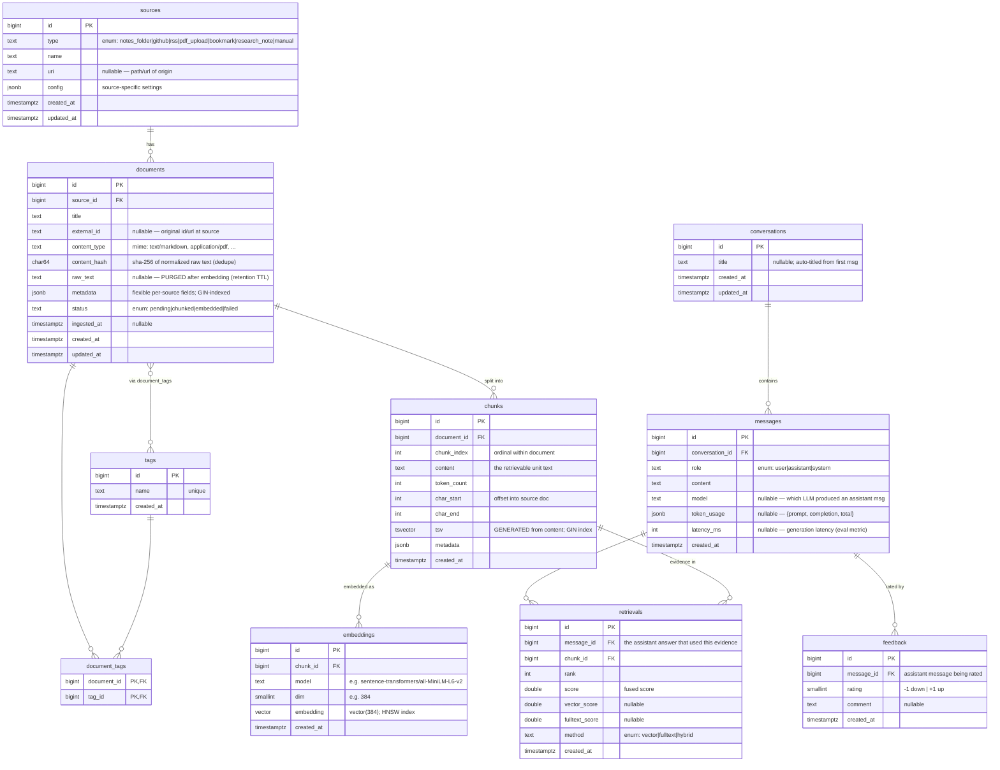
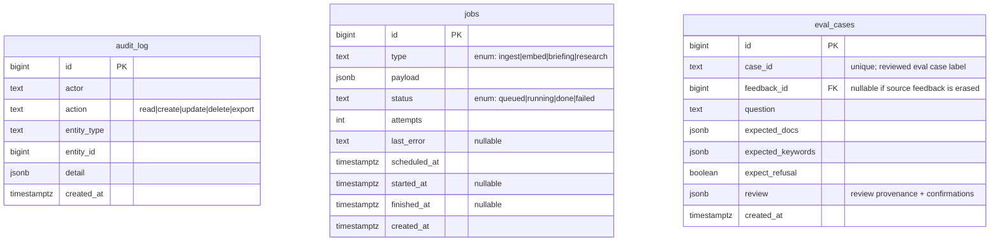

# Second Brain — Phase 0 Data Model (ER Diagram)

> **Status:** implemented. The original Phase 0 schema has since grown through Alembic migrations;
> this document captures the relational spine plus the major supporting tables.

This is the relational spine for the whole project: the `sources → documents → chunks → embeddings`
ingest lineage, the `conversations → messages → retrievals → feedback` chat/evidence lineage, plus
governance (`audit_log`) and pipeline (`jobs`) tables that the plan calls for.

---

## ER diagram

### Supporting tables (governance + pipeline — modeled now, used later)

---

## Indexes (planned)

| Table | Index | Purpose |
|---|---|---|
| `documents` | `UNIQUE (source_id, content_hash)` | dedupe — never ingest the same item twice per source |
| `documents` | `GIN (metadata jsonb_path_ops)` | queryable flexible metadata |
| `documents` | `btree (source_id)`, `btree (status)` | lineage + pipeline scans |
| `chunks` | `UNIQUE (document_id, chunk_index)` | stable chunk ordering |
| `chunks` | `GIN (tsv)` | full-text / lexical retrieval |
| `embeddings` | `HNSW (embedding vector_cosine_ops)` | approximate nearest-neighbour vector search |
| `embeddings` | `UNIQUE (chunk_id, model)` | one vector per chunk per model |
| `messages` | `btree (conversation_id, created_at)` | thread reads |
| `retrievals` | `btree (message_id)`, `btree (chunk_id)` | citation lookups both directions |
| `feedback` | `btree (message_id)` | answer-quality analytics |
| `jobs` | `btree (status, scheduled_at)` | worker poll |
| `eval_cases` | `UNIQUE (case_id)`, `btree (feedback_id)` | durable reviewed eval-case storage |

---

## Open design decisions (need your sign-off)

These are the "real decisions" AGENTS.md says get an ADR. I have a recommendation for each; the
schema above assumes the **recommended** option. Confirm or override and I'll lock them into ADRs.

### D1 — Embeddings: separate table, single fixed model/dim (→ **ADR-0002**)
A pgvector column has a **fixed dimension**, so multi-model support isn't free. I kept `embeddings`
as a *separate* table (not a column on `chunks`) with `vector(384)` for
`all-MiniLM-L6-v2`. **Recommendation:** one active model, dim 384, but keep the table separable so a
future re-embed with a different model is an additive migration, not a rewrite. *Alternative:* collapse
into `chunks.embedding` (simpler, but couples re-embedding to the chunk row).

### D2 — Chunking strategy (→ **ADR-0003**)
Schema stores `token_count`, `char_start/end`, `chunk_index` — strategy-agnostic. But the *values* need
a policy. **Recommendation:** ~512-token chunks, ~15% overlap, split on semantic boundaries
(headings/paragraphs) with a token-count fallback. This is the classic safe default for MiniLM-class
models. Want me to write the ADR proposing this, or do you have a target chunk size in mind?

### D3 — Pipeline trigger: `jobs` table vs `LISTEN/NOTIFY` (→ **ADR-0004**)
The plan flags this explicitly. **Recommendation:** include a `jobs` table now (durable, restart-safe,
inspectable — survives a worker crash) and use `LISTEN/NOTIFY` only as a low-latency *wake-up* signal on
top of it. Pure NOTIFY loses events if no listener is connected. *Alternative:* NOTIFY-only (less infra,
but at-most-once delivery).

### D4 — Keys: `bigint` identity vs `uuid`
Diagram uses `bigint GENERATED ALWAYS AS IDENTITY` (smaller, faster joins/indexes, fine for single-user).
**Recommendation:** keep bigint. Switch to uuid only if you ever want client-generated IDs or to hide row
counts. Single-user app → bigint wins.

### D5 — `raw_text` retention
`documents.raw_text` is nullable on purpose: store on ingest, then null it out after the retention TTL
while preserving chunks for retrieval. This reduces duplicate raw-source storage but is not
anonymization; source erasure is the path that removes documents, chunks, and embeddings.

---

## What's intentionally NOT here yet
- **RLS policies / `audit_log` triggers** — Phase 6 hardening. Tables are modeled; policies come later.
- **Materialized views** (latency percentiles, most-cited sources) — Phase 3/6 analytics, built on this spine.
- **`research_note` flow** — reuses `sources`(type=research_note) → `documents`; no new tables needed.
